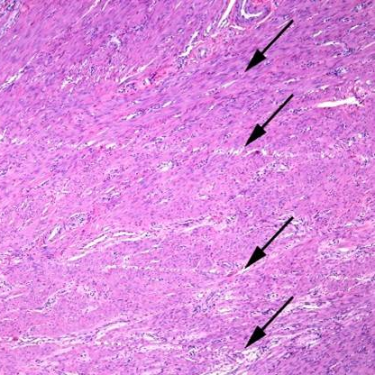
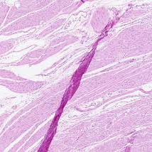
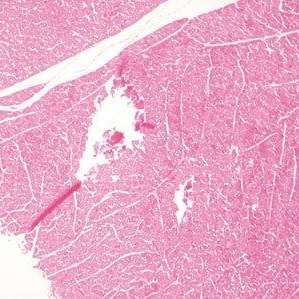
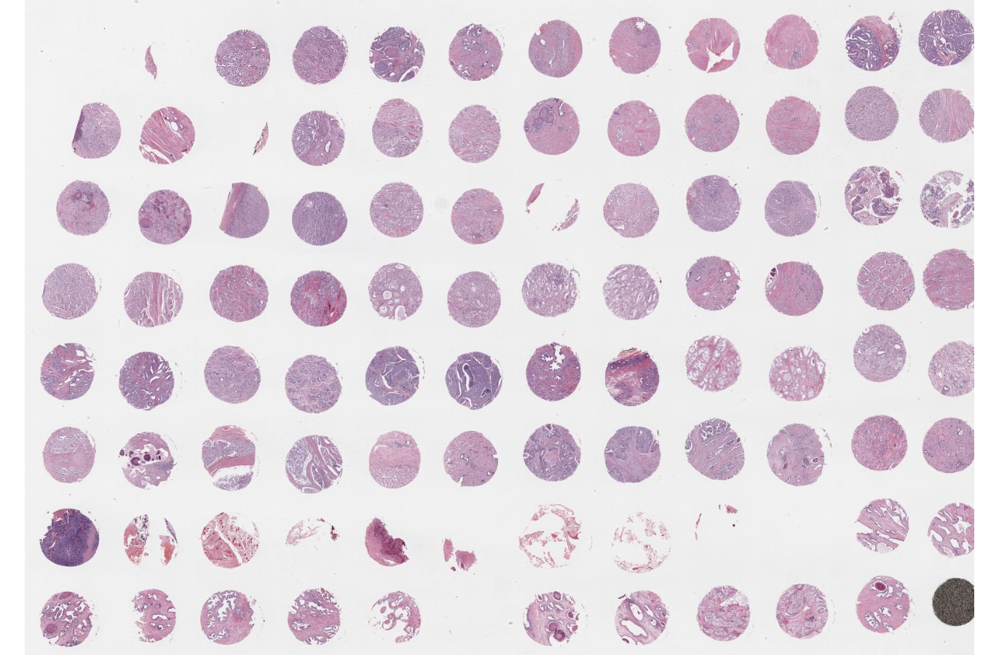

# Experimental design {#sec-experimental-design}



## Introduction

Proper experimental design is the cornerstone of any spatial omics study. 
Unlike bulk or single-cell RNA-seq, spatial omics adds a physical dimension 
that introduces unique challenges, from sampling bias to tissue artifacts. 

This chapter touches on a few design considerations, including the lifecycle 
of a tissue sample (from biopsy to measurement), key concepts of replication, 
as well as strategies to guide panel and regions of interest (ROI) selection.

## Sample lifecycle \& artifacts

The journey from a biological specimen to a digital data point 
involves several steps, each prone to specific artifacts.

### Biopsy to fixation

The method of tissue collection (e.g., core needle biopsy, surgical resection) 
can induce cellular stress responses or mechanical damage. Rapid stabilization 
is essential to truly preserve spatial-molecular profiles. Within minutes, 
delays in fixation can lead to **hypoxic stress** signatures that will alter 
molecular profiles. Physical handling can lead to **mechanical damage**, or
"crush artifacts". During sectioning, for instance, tissue folds or tears can 
create "hot spots" of aggregated biopolymers, or "cold spots" where tissue is 
lost. And, blade (too dull) and cut quality (uneven direction or speed) can 
introduce so-called "knife chatter": parallel lines or microscopic cracks.

::: {#fig-hne fig-align="center"}

::: {.layout-ncol=3}
{width=25%}
{width=25%}
{width=25%}
:::

Exemplary **histology artifacts** from knife chatter, tissue folding, and 
physical tearing (there are many, many more!) *[source: arXiv:1903.07011, 
https://labstore.com, and https://www.leicabiosystems.com]*
:::

### Fixation modalities: FF vs. FFPE

The choice between fixation modalities is often dictated by clinical 
availability and the required resolution of downstream morphology.

- **Fresh Frozen (FF):** Generally offers higher RNA integrity and is compatible 
with a wider range of discovery-based assays. However, it requires strict cold 
chain management and often yields poorer morphological detail compared to FFPE.

- **Formalin-Fixed Paraffin-Embedded (FFPE)** is standard for clinical pathology. 
Formalin fixation stabilizes the tissue and preserves morphology for years, but it 
also induces cross-linking and fragments the RNA. This fragmentation necessitates 
specialized capture methods, such as probe-based capture, to ensure sensitivity.

::: {.callout-note collapse="true" title="Archival stability of macromolecules in FFPE"}

While FFPE blocks are often perceived as "deteriorating" over time, biological
macromolecules remain remarkably stable for decades if stored at room temperature. 

- **DNA** is the most resilient, and remains stable for sequencing in blocks 
stored for **over 40-50 years** with minimal quality impact [@Kokkat2013-FFPE], 
making archival cohorts a robust resource for retrospective genomic studies.

- **RNA** is more sensitive than RNA, yet still highly durable. 
High-quality whole-transcriptome data has be recovered from FFPE blocks 
stored for **up to 20-30 years**, with approximately 60% of samples yielding 
usable libraries [@Hedegaard2014-FFPE]. Beyond this window, RNA-seq success 
rates drop as fragmentation and chemical modifications become prohibitive.

- **Protein:** Proteins are highly stable within the paraffin matrix of an intact 
block for **at least a decade**. However, *antigenicity* (the ability of antibodies 
to bind) is the most sensitive to environmental exposure once the block is cut.

There is a critical distinction exists between **blocks** and **cut slides**: 
while blocks are stable for years, once sections are cut and placed on slides, 
macromolecules -- especially RNA and protein antigenicity -- degrade due to 
surface oxidation. For spatial omics, immediate use or vacuum-sealing of cut 
slides is essential to preserve signal intensity and, ultimately, data quality.

:::

### FFPE considerations

FFPE is currently the dominant clinical sample type. 
Due to its unique properties, specific quality control and chemistry 
considerations are required [@Lundberg2019-proteomics; @Semba2024-multiplexed].

#### Quality control: RIN vs. DV200

The traditional **RNA Integrity Number (RIN)** metric used to scores RNA quality 
on a scale from 1 (completely degraded) to 10 (fully intact) by analyzing the 
ratio of ribosomal RNA subunits via electrophoretic traces [@Schroeder2006-RIN]. 
However, because RNA is extensively fragmented in FFPE tissue,
RIN is often less informative for clinical samples.

Consequently, metrics such as **DV200 Index** [@Matsubara2020-DV200] (percentage
of RNA fragments >200 nucleotides) are widely used indicators of RNA quality and 
are often better predictors of library success in FFPE workflows.

While these RNA integrity metrics are essential for sequencing-based ST, their 
relevance is reduced in imaging-based platforms that rely on targeted probe 
hybridization, as detection depends primarily on short hybridization regions 
rather than full-length transcript integrity [@Ke2013; @Chen2015].

#### Capture chemistry: poly-dT vs. probe-based

The degree of RNA fragmentation in FFPE makes traditional poly-dT capture 
(which targets the 3' tail) less effective. To overcome this, many spatial 
platforms (e.g., 10x Genomics' Visium) instead use *probe-based chemistry*. 
This involves hybridization of pairs of probes to specific mRNA sequences, 
providing significantly higher sensitivity in fragmented clinical samples.

## Statistical design & power analysis

### Replication: technical vs. biological

A robust experimental design must distinguish between technical and biological 
replicates. This distinction is critical for correctly estimating statistical 
power and ensuring that findings can be generalized to a broader population.
[The goal one should have is not "I want to analyze this data." but
"I want to learn about a fundamental biological principle."]{.aside}

- **Technical replicates** are repeated measurements taken from the 
same biological unit. In spatial omics, this commonly includes:
  - Serial sections taken from the same tissue block.
  - Processing the same sample across multiple slides or runs.
  - Treating multiple cells or spots within a slice as independent.
  
- **Biological replicates** are independent samples from different 
biological entities (e.g., different mice or patient donors). 
They represent the experimental unit $N$ that is typically reported 
in publications, and are used to test hypotheses about a population. 
[Increasing $N$ serves to better estimate within-group variability, 
thereby increasing the power of statistical tests to detect actual 
between-group differences. In other words: accounting for biological 
variation allows one to arrive at more generalizable findings.]{.aside}

While technical replicates increase the precision of an estimate for a 
specific biological unit, they do not increase the sample size $N$ for
comparing groups (e.g., wild type vs. knockout, control vs. treatment). 
Differences in these levels of variation can be visualized via a "replication 
scatter plot", where technical replicates (e.g., adjacent slices) show tight 
correlation, whereas biological replicates (e.g., different donors) do not.
[Misunderstanding of this -- treating technical replicates as if they were 
independent biological samples -- is called **pseudo-replication**.]{.aside}

### Batch Effects

Spatial runs are often processed in small batches. Randomization of samples 
across slides and batches is critical to avoid confounding biological signal 
with technical variation.

### Units of analysis & pseudo-replication

Understanding appropriate units of analysis is critical for both (spatial)
power analysis and downstream statistical modeling. Failing to distinguish 
between these units can lead to pseudo-replication, where the sample size is
artificially inflated, leading to overconfident conclusions ("over-selling").

- **Biological Unit (BU)** = entity of interest that provides replication 
for the population you wish to generalize to (e.g., mouse, human donor).

- **Experimental Unit (EU)** = smallest entity that can be *independently*
assigned to a treatment or experimental group; the unit of randomization.
In many spatial studies, the EU is a specific tissue block.

- **Observational Unit (OU)** = entity on which a measurement is actually taken;
also called the *sampling unit*, this is the level at which raw data is collected.
In spatial omics, the definition of an OU depends on the platform's resolution.

::: {.column-margin}
The OUs for Visium, Visium HD/Stereo-seq, and CosMx/Xenium are spots, bins, and 
segmented cells, respectively; for all of them, the EU is an individual animal or 
donor. When comparing experimental conditions (e.g., healthy vs. diseased tissue), 
the number of independent replicates $N$ is determined by the number of EUs 
(individuals), not the number of OUs (bins/spots/cells). Put differently, 
data on ten million cells from ten patients does not mean clinical relevance.
:::

### Spatial power analysis

In spatial omics, we must also consider the spatial arrangement of cells 
and features as part of a larger 3D organization (the actual tissue). 
Spatial power analysis aims to determine a sensible sampling strategy:

1. **Tissue composition:** How many cells of a specific type are needed to detect a rare interaction?
2. **Field of view (FOV) selection:** What tissue area or number of FOVs are required to capture spatial heterogeneity?
3. **In silico tissue (IST)** can be used to simulate tissue structures and 
optimize their design before performing the actual experiment [@Imkeller2023].

## Panel design & ROI selection

### Selecting RNA targets

For imaging-based platforms (e.g., Xenium, CosMx, MERFISH), selecting the right 
gene panel is a critical experimental step [@Baran2023-marker; @Kuemmerle2024-probe-set].

- **Exploratory vs. hypothesis-driven:** Panels should include "anchor" markers 
for common cell types and "exploratory" targets for biological discovery.

- **Density and bleeding:** Higher plexity can increase background noise and 
spatial beeling [@Kuemmerle2024-probe-set] (see also @sec-img-segmentation).

### Selection microdissection sites

Some technologies like [Bruker's GeoMx](https://brukerspatialbiology.com/products/geomx-digital-spatial-profiler/) 
require pre-selecting **regions of interest (ROIs)** for molecular profiling. 
Unlike whole-tissue imaging, these platforms rely on **microdissection**.
[Microdissection is typically **destructive**: techniques like traditional Laser 
Capture Microdissection (LCM) physically cut out and destroy tissue for analysis. 
GeoMx instead relies on UV-cleavable barcodes that are released upon UV light
exposure, allowing for **non-destructive** "virtual" microdissection.]{.aside}

- **Segmenting:** Defining Areas of Interest (AOIs) within an ROI based on 
morphology markers. For example, using Pan-Cytokeratin (PanCK) to separate 
the "tumor" from the "stroma" [@Beechem2020; @Merritt2020].

- **Gridding:** Placing geometric shapes at regular intervals 
for unbiased sampling across a large area.

- **Contouring:** Drawing concentric bands around a landmark (e.g., a tertiary 
lymphoid structures, blood vessel, or tumor interface) to analyze cellular
patterns and gene expression as a function of distance [@Beechem2020].

### Tissue Microarrays (TMAs)

Tissue Microarrays (TMAs) have become the primary vehicle 
for scaling ST to large clinical cohorts [@Kononen1998-TMA].

- **Throughput:** TMAs allow simultaneous processing of dozens of patient cores 
(usually 0.6 mm to 3 mm in diameter) on a single slide, offering a means to 
increase sample size while reducing intra-slide technical variability.

- **Sampling bias:** The primary risk of TMAs is sampling bias, where 
a small core may not capture the full heterogeneity of the donor tissue.

- **Control core(s):** It is common practice to include control tissues (such as
a well-characterized reference, or cell line pellets) to support QC of staining 
or hybridization assays (e.g., IHC/ISH), to enable normalization across slides 
and batches, or to serve as (physical) orientation guides.

::: {#fig-tma fig-align="center"}
{width=50%}
*[source: https://geneticistusa.com/]*
:::

## Appendix

::: {.callout-tip icon="false" title="Further reading"}

- @Taqi2018 provide a comprehensive review of **artifacts in histopathology**,  
including (pre)fixation, tissue-processing, staining artifacts, and more.

:::

### References {.unnumbered}


